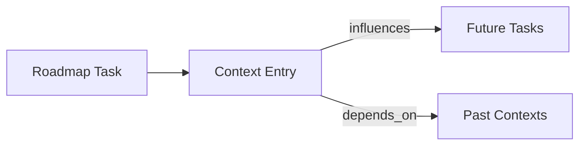

# Revised Memory Architecture Analysis

## Core Context Preservation System

### Implemented Features
✅ **Encrypted Context Transfer**  
```bash
context-transfer export -o session_ctx.json
# Exports AES-256 encrypted context bundle
```

✅ **Session-Aware Memory**  
```typescript
// Queries last 5 context entries
const sessionContext = await ContextSystem.queryMemory('session-context', 5);
```

✅ **Versioned Snapshots**  
- Hourly/daily snapshots with retention policies
- Atomic transaction support

### Missing Requirements
⚠️ **Context Continuity Gaps**  
1. No automatic injection of previous session context
2. Limited metadata for task dependencies
3. No context summarization/compression

## Roadmap Implementation Review

### Phase 4 - Context Transfer Protocol
```typescript
// scripts/context-transfer.ts
export function encryptContext(payload: string) {
  return {
    encryptedPayload: aes256.encrypt(key, payload),
    checksum: sha256(payload),
    version: CONTEXT_VERSION
  };
}
```
✅ Implements secure transfer but lacks:
- Automatic version migration
- Context validation against roadmap
- Dependency resolution

## Recommended Improvements

1. **Automatic Context Priming**
```typescript
// Proposed session initialization
async function initSession() {
  const previousContext = await MemoryMcp.getLatestContext();
  const compressed = await summarizeContext(previousContext);
  return `${compressed}\n\nCurrent Task: ${roadmap.nextTask}`;
}
```

2. **Roadmap-Context Integration**


3. **Token Optimization**
- Implement context summarization
- Add relevance scoring
- Develop adaptive retention policies