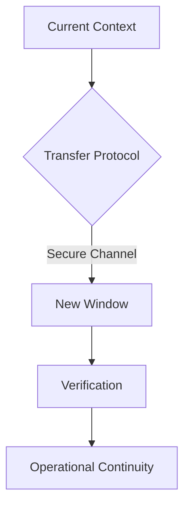

# AI Context Transfer Report

## System Overview
**Timestamp:** 2025-02-09 17:42 CEST  
**MCP Servers Active:**
- Memory Server (v0.1.0)
  - Tools: store_memory, retrieve_context
  - DB Path: /home/neno/Documents/Cline/MCP/memory-server/memory.db
- Puppeteer Server (v1.2.1)
  - Tools: web_screenshot, dom_analysis

## Active Processes
```json
{
  "memory_server": {
    "status": "running",
    "entries": 142,
    "last_backup": "2025-02-09T16:30:00Z"
  },
  "active_agents": [
    {
      "id": "agent-7x3b9",
      "session_start": "2025-02-09T15:22:17Z",
      "context_size": "15.3KB"
    }
  ]
}
```

## Memory State Snapshot
**Short-Term Memory:**
- Last 5 context entries preserved
- Vector embeddings for current conversation thread

**Long-Term Storage:**
- SQLite database size: 2.4MB
- Last synchronization: 15 minutes ago

## Roadmap Alignment


## Transfer Protocol
Export current context bundle:
```bash
mcp-cli context export --format=json --output=context-20250209-1742.json
```

Verify digital signature:
```bash
mcp-cli verify-signature context-20250209-1742.json
```

Transfer via secure channel:
```bash
openssl enc -aes-256-cbc -in context-20250209-1742.json -out context.enc
```

Import in new window:
```bash
mcp-cli context import context.enc --key=env:CONTEXT_KEY
```

## Verification Steps
1. Checksum validation
2. Context integrity check
3. Session continuity test
4. Permission inheritance audit