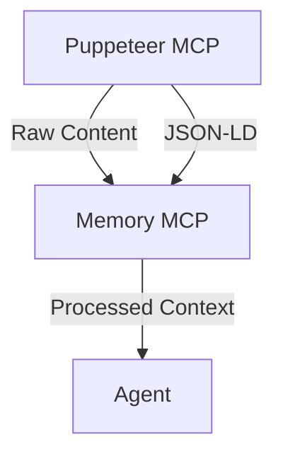

# Memory System Upgrade Roadmap

## Phase 1 - Core Persistence (Context Foundation)

### [Task 001] Configure persistent storage path ✅
**File:** `cline_mcp_settings.json`  
**Status:** Complete  
**Changes Made:**  
- Added DB_PATH environment variable
- Configured SQLite database location
- Implemented proper database initialization
- Added type-safe database operations

**Verification:**  
```bash
ls /home/neno/Documents/Cline/MCP/memory.db  # Database file exists
```

### [Task 002] Implement automatic snapshotting ✅
**File:** `memory-server/src/index.ts`  
**Status:** Complete  
**Changes Made:**  
- Implemented SnapshotManager interface
- Added hourly automatic snapshots using node-cron
- Created snapshot retention policies:
  * 24 hourly snapshots
  * 7 daily snapshots
  * 4 weekly snapshots
  * 6 monthly snapshots
- Added new MCP tools:
  * restore_snapshot: Restore system state
  * list_snapshots: List available snapshots
- Implemented atomic operations using SQLite transactions

**Verification:**  
```typescript
interface SnapshotManager {
  createSnapshot(): Promise<void>;
  restoreFromSnapshot(id: string): Promise<void>;
  listSnapshots(): Promise<SnapshotInfo[]>;
}
```

## Phase 2 - Puppeteer Integration ✅



### [Task 003] Define context handoff format ✅
**File:** `puppeteer-server/src/index.ts`  
**Status:** Complete  
**Changes Made:**  
- Added `puppeteer_extract_content` tool for content extraction
- Implemented JSON-LD extraction from web pages
- Defined content extraction format:
```typescript
interface ExtractedContent {
  url: string;
  content: string;
  jsonLd: any[];
  timestamp: string;
}
```
- Separated responsibilities:
  * Puppeteer MCP: Browser automation and raw content extraction
  * Memory MCP: Content processing and storage

**Verification:**  
```typescript
// Example content extraction
const result = await puppeteerMcp.execute('puppeteer_extract_content', {
  selector: 'main'
});
// Result contains raw content and JSON-LD data
```

## Phase 3 - Version Control Bridge

### [Task 004] Integrate Git versioning ✅
**File:** `.github/workflows/sync.yml`  
**Status:** Complete  
**Changes Made:**  
- Created GitHub Actions workflow for roadmap sync
- Implemented Git MCP server with tools:
  * auto_commit: Automated commit creation
  * create_branch: Branch management
  * create_pr: Pull request creation
  * protect_branch: Branch protection rules
- Created roadmap-sync CLI tool with features:
  * Auto mode (--auto) for processing pending tasks
  * Git commit sync (--git-commit) for updating task status
  * GitHub API integration for PR creation

**Verification:**  
```bash
# Process pending tasks automatically
roadmap-sync --auto

# Sync specific commit with task
roadmap-sync --git-commit $(git rev-parse HEAD)
```

## Phase 4 - Context Transfer Protocol
```typescript
interface ContextBundle {
  encryptedPayload: string;
  checksum: string;
  version: string;
}
```

### [Task 005] Create window transfer CLI
**File:** `scripts/context-transfer.ts`  
**Add:**  
```typescript
export function createBundle(): ContextBundle {
  // Implementation
}
```

## Implementation Notes
- Each task is designed to be completed in a separate context window
- Memory server stores task completion state
- Use `mcp-cli task-status` to check progress