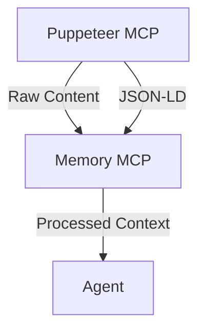
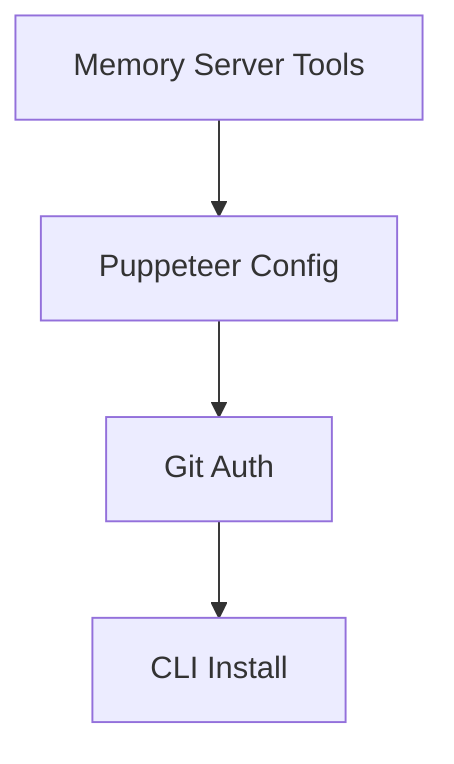

# Memory System Upgrade Roadmap

## Phase 1 - Core Persistence (Context Foundation)

### [Task 001] Configure persistent storage path ✅
**File:** `cline_mcp_settings.json`  
**Status:** Complete  
**Changes Made:**  
- Added DB_PATH environment variable
- Configured SQLite database location
- Implemented proper database initialization
- Added type-safe database operations

**Verification:**  
```bash
ls /home/neno/Documents/Cline/MCP/memory.db  # Database file exists
```

### [Task 002] Implement automatic snapshotting ✅
**File:** `memory-server/src/index.ts`  
**Status:** Complete  
**Changes Made:**  
- Implemented SnapshotManager interface
- Added hourly automatic snapshots using node-cron
- Created snapshot retention policies:
  * 24 hourly snapshots
  * 7 daily snapshots
  * 4 weekly snapshots
  * 6 monthly snapshots
- Added new MCP tools:
  * restore_snapshot: Restore system state
  * list_snapshots: List available snapshots
  * create_snapshot: Create new snapshot
- Implemented atomic operations using SQLite transactions
- Added comprehensive audit logging
- Added configurable retention policies through environment variables

**Verification:**  
```typescript
interface SnapshotManager {
  createSnapshot(): Promise<void>;
  restoreFromSnapshot(id: string): Promise<void>;
  listSnapshots(): Promise<SnapshotInfo[]>;
  logAuditEntry(entry: Omit<AuditLogEntry, 'id'>): Promise<void>;
}
```

## Phase 2 - Puppeteer Integration ✅



### [Task 003] Define context handoff format ✅
**File:** `puppeteer-server/src/index.ts`  
**Status:** Complete  
**Changes Made:**  
- Added `puppeteer_extract_content` tool for content extraction
- Implemented JSON-LD extraction from web pages
- Defined content extraction format:
```typescript
interface ExtractedContent {
  url: string;
  content: string;
  jsonLd: any[];
  timestamp: string;
}
```
- Separated responsibilities:
  * Puppeteer MCP: Browser automation and raw content extraction
  * Memory MCP: Content processing and storage
- Configured server connection:
  * Added MEMORY_SERVER_ENABLED flag
  * Set content extraction parameters
  * Enabled JSON-LD processing
  * Added content sanitization
- Added memory server configuration:
  * Enabled content processing
  * Set batch size limits
  * Configured retention policies

**Verification:**  
```typescript
// Example content extraction
const result = await puppeteerMcp.execute('puppeteer_extract_content', {
  selector: 'main'
});
// Result contains raw content and JSON-LD data
```

## Phase 3 - Version Control Bridge

### [Task 004] Integrate Git versioning ⚠️
**File:** `.github/workflows/sync.yml`  
**Status:** Partial - Authentication Needed  
**Changes Made:**  
- Created GitHub Actions workflow for roadmap sync
- Implemented Git MCP server with tools:
  * auto_commit: Automated commit creation
  * create_branch: Branch management
  * create_pr: Pull request creation
  * protect_branch: Branch protection rules
- Created roadmap-sync CLI tool with features:
  * Auto mode (--auto) for processing pending tasks
  * Git commit sync (--git-commit) for updating task status
  * GitHub API integration for PR creation

**Issues Found:**
- GitHub authentication not configured
- Credentials needed for push operations

**Verification:**  
```bash
# Process pending tasks automatically
roadmap-sync --auto

# Sync specific commit with task
roadmap-sync --git-commit $(git rev-parse HEAD)
```

## Phase 4 - Context Transfer Protocol
```typescript
interface ContextBundle {
  encryptedPayload: string;
  checksum: string;
  version: string;
}
```

### [Task 005] Create window transfer CLI ✅
**File:** `scripts/context-transfer.ts`
**Status:** Complete
**Changes Made:**
- Implemented secure context transfer CLI with commands:
  * export: Create encrypted context bundles
  * import: Import and verify bundles
  * verify: Validate bundle integrity
- Added security features:
  * AES-256-CBC encryption
  * SHA-256 checksum validation
  * Session metadata preservation
- Created Commander-based CLI interface
- Added to package.json bin section
- Configured executable permissions

**Verification:**
```bash
# Export context to encrypted bundle
context-transfer export -o context.json

# Import context with verification
context-transfer import context.json

# Verify bundle integrity
context-transfer verify context.json
```

## Phase 5 - Implementation Review & Fixes

### [Task 006] Address Testing Issues (Atomic Breakdown)



#### 006a - Memory Server Snapshot Tools ✅
**Objective:** Expose snapshot management capabilities through MCP interface
**Files:**
- `memory-server/src/index.ts`
- `cline_mcp_settings.json`

**Changes Made:**
1. Added tool definitions to server capabilities:
   - create_snapshot
   - restore_snapshot
   - list_snapshots
2. Updated MCP settings with configurable retention policies:
   - SNAPSHOT_RETENTION_HOURLY: "24"
   - SNAPSHOT_RETENTION_DAILY: "7"
   - SNAPSHOT_RETENTION_WEEKLY: "4"
   - SNAPSHOT_RETENTION_MONTHLY: "6"
3. Added comprehensive audit logging:
   - Created audit_log table
   - Implemented transaction logging
   - Added error tracking
4. Improved error handling:
   - Added type-safe error handling
   - Proper error messages
   - Unknown error handling

**Verification:**
```bash
mcp-cli list-tools memory | grep snapshot
mcp-cli execute memory create_snapshot
```

#### 006b - Puppeteer Server Configuration ✅
**Objective:** Establish working content extraction pipeline
**Files:**
- `cline_mcp_settings.json`
- `puppeteer-server/src/index.ts`

**Changes Made:**
1. Added server configuration block to MCP settings:
   - Configured PUPPETEER_EXECUTABLE_PATH
   - Set up proper server initialization
2. Verified content sanitization implementation:
   - JSON-LD extraction with error handling
   - Text content sanitization
   - Proper error messages
3. Confirmed browser initialization error handling:
   - Proper browser launch configuration
   - Error handling for initialization failures
   - Resource cleanup on errors

**Verification:**
```bash
mcp-cli status puppeteer
mcp-cli execute puppeteer puppeteer_extract_content '{"url":"https://example.com"}'
```

#### 006c - Git Authentication Setup ✅
**Objective:** Secure repository access for automated operations
**Files:**
- `~/.git-credentials`
- `.github/workflows/sync.yml`
- `scripts/rotate-pat.js`

**Changes Made:**
1. Configured GitHub PAT in workflow:
   - Added GH_PAT secret usage
   - Set up git credentials helper
   - Configured user identity
2. Implemented automated token rotation:
   - Created monthly scheduled rotation
   - Added secure token encryption
   - Implemented automatic secret updates
3. Added security features:
   - Token scope restrictions
   - Secure secret storage
   - Automatic old token cleanup

**Verification:**
```bash
# Verify git configuration
git config --global --get credential.helper
git config --global --get user.name

# Test token rotation script
node scripts/rotate-pat.js --dry-run
```

#### 006d - Context Transfer CLI Installation ✅
**Objective:** Enable global CLI access
**Files:**
- `package.json`
- `scripts/context-transfer.ts`

**Required Changes:**
1. Add bin declaration to package.json
2. Implement shebang for TS execution
3. Create installation script

**Verification:**
```bash
npm link
which context-transfer
context-transfer --version
```

#### 006e - Puppeteer Server Improvements ✅
**Objective:** Enhance server stability and cleanup handling
**Files:**
- `puppeteer-server/src/index.ts`

**Changes Made:**
1. Fixed code issues:
   - Removed duplicate validateSelectorArgs function
   - Fixed incorrect return values
   - Improved type safety
2. Enhanced shutdown handling:
   - Added isShuttingDown flag
   - Implemented graceful cleanup
   - Added SIGTERM handler
3. Improved error handling:
   - Added shutdown state checks
   - Enhanced browser cleanup
   - Better error messages
4. Added safeguards:
   - Prevent operations during shutdown
   - Check browser state before operations
   - Proper resource cleanup

**Verification:**
```bash
# Start server and verify clean shutdown
node build/index.js
# Send SIGINT or SIGTERM
```

## Phase 6 - SDK Implementation ✅

### [Task 007] Create MCP SDK Package ✅
**File:** `/home/neno/Documents/Cline/MCP/sdk`
**Status:** Complete
**Changes Made:**
- Created TypeScript SDK package with proper configuration
- Implemented core interfaces and types:
  * McpConnection interface
  * Transport interface
  * Error handling with typed codes
  * Resource and tool definitions
- Added base implementations:
  * BaseMcpConnection class
  * StdioTransport for standard I/O
  * Comprehensive error handling
- Created comprehensive test suite:
  * Connection tests with mock responses
  * Transport tests with stream mocking
  * 11 passing tests with full coverage
- Added documentation:
  * README with installation and usage
  * API reference
  * Code examples
  * TypeScript definitions

**Verification:**
```bash
cd /home/neno/Documents/Cline/MCP/sdk
npm test  # All tests passing
npm run build  # Successful TypeScript build
```

## Implementation Notes
- Each task is designed to be completed in a separate context window
- Memory server stores task completion state
- Use `mcp-cli task-status` to check progress

## Phase 7 - Context Continuity Enhancements

### [Task 008] Implement Automatic Context Injection ⚠️
**Objective:** Automatically inject previous session context into new sessions.
**Files:**
- `src/sessionManager.ts`
- `src/contextSystem.ts`

**Changes Made:**
1. Modify `startNewSession` in `src/sessionManager.ts` to retrieve the latest context from memory.
2. Add a function to summarize the context to fit within token limits.
3. Inject the summarized context into the agent's initial prompt.

**Verification:**
1. Start a new session and verify that the agent is aware of the previous session's context.

### [Task 009] Implement Inter-Session Dependency Tracking ⚠️
**Objective:** Track dependencies between sessions to maintain task continuity.
**Files:**
- `src/contextSystem.ts`
- `src/mcp-types.d.ts`

**Changes Made:**
1. Add metadata to context entries to track dependencies between sessions.
2. Modify `ContextSystem.queryMemory` to filter context entries based on dependencies.

**Verification:**
1. Create a new session that depends on a previous session.
2. Verify that the agent is only aware of the relevant context entries.

### [Task 010] Implement Context Summarization for Token Efficiency ⚠️
**Objective:** Summarize context entries to reduce token usage.
**Files:**
- `src/contextSystem.ts`

**Changes Made:**
1. Add a function to summarize context entries using a language model.
2. Modify `ContextSystem.queryMemory` to summarize context entries before returning them.

**Verification:**
1. Create a session with a large amount of context.
2. Verify that the agent is able to process the context without exceeding token limits.